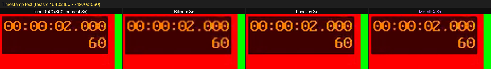
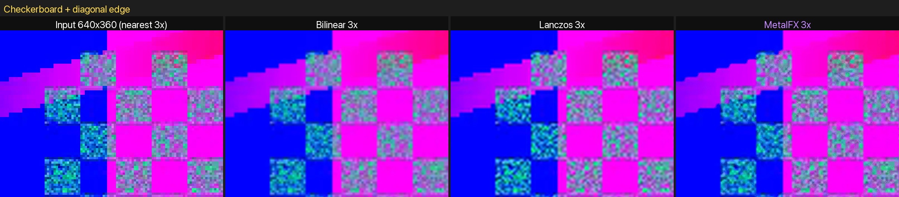
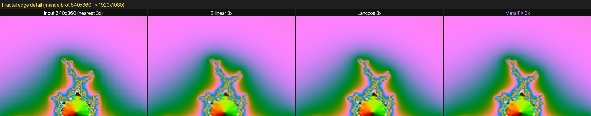

# MetalFX Movie Player

**日本語** | [简体中文](README.zh-CN.md)

動画デコード → Metal テクスチャ → MetalFX Spatial → 高解像度表示
のパイプラインを持つ macOS / iOS 動画プレイヤー。

## パイプライン

```
AVPlayer + AVPlayerItemVideoOutput   (VideoToolbox デコード, BGRA + Metal 互換バッファ)
        │
        ▼
CVMetalTextureCache                  (ゼロコピー CVPixelBuffer → MTLTexture)
        │
        ▼
MTLFXSpatialScaler                   (表示に必要なテクセル密度へアップスケール)
        │
        ▼
Aspect-fit quad + preferredTransform UV 適用 + linear sampler
                                     (MTKView drawable へ 1:1 描画)
```

- ウィンドウの backing scale を考慮した **物理ピクセル単位** でアップスケールするため、
  Retina ディスプレイでは低解像度動画がネイティブ解像度でシャープに表示される
- MetalFX はアップスケーラーのため、出力サイズが入力未満の場合のみ
  デコード済みテクスチャを直接描画する(downscale パス、偽装なし)
- `preferredTransform` は描画時の UV マップとして適用され、90°/270° 回転・
  反転・トランスフォーム由来のアナモルフィックを正しく表示する。
  表示アスペクトには `CMVideoFormatDescriptionGetPresentationDimensions`
  (ピクセルアスペクト比・クリーンアパーチャ込み)を使用。
  90° 回転時はスケーラー出力が転置されるため、表示 1 ピクセルあたり
  1 テクセルの密度が維持される
- 再生に失敗した場合はエラーがウィンドウサブタイトルに表示される
- 音声は AVPlayer がそのまま再生

## MetalFX の効果

640×360 の入力を 1920×1080 へ 3 倍アップスケールした場合の比較。
いずれもアプリと同じ `MTLFXSpatialScaler`(perceptual モード)で生成。
入力素材は ffmpeg の `testsrc2` / `mandelbrot` で生成した合成パターン
(著作権上の制約なし):

### テキスト



### 細部(チェッカーボード + 斜めエッジ)



### フラクタルの細線



nearest はジャギー、bilinear はぼやけ、lanczos はシャープだが
エッジにリンギングが残るのに対し、MetalFX は小さな文字や
微細な輪郭を再構成してシャープに描画します。

## 要件

- macOS 14 以降
- Apple Silicon(MetalFX Spatial が必要)

## 実行

```sh
swift run MovieFXPlayer [video.mp4]
# または
swift build && .build/debug/MovieFXPlayer path/to/video.mp4
```

引数なしの場合はファイルパネルが開く。ドラッグ&ドロップにも対応。

## iOS 版

`ios/` に iPhone / iPad 版の Xcode プロジェクトがある。
macOS 版と同じデコード → MetalFX パイプラインを共有しており、
`Sources/MovieFXPlayer/MetalFXRenderer.swift` と `VideoPlayer.swift` は
そのまま iOS ターゲットでもコンパイルされる
(`PlayerSeekUpdating` プロトコルでシーク UI のみプラットフォーム側に抽象化)。

### 機能

- **ライブラリ**: 登録した動画をサムネイル・再生時間付きで一覧表示。
  ファイルは security-scoped ブックマークで**原本を参照**(コピーしない)。
  ドラッグ&ドロップのみ原本を参照できないため `Documents/Media/` に退避する。
  行の長押しで「次に再生」「キューに追加」「ライブラリから削除」、
  編集モードで並べ替え・削除。原本が削除・移動されると「見つかりません」表示
- **キュー**: ライブラリから再生すると全件がキューになり終端で自動進行。
  キュー画面(右上リストボタン)でジャンプ・並べ替え・削除・クリア。
  前/次スキップボタン付き(前ボタンは再生位置 3 秒以内のみ前項目、
  それ以外は先頭へ)
- **ループ**: リピートボタンで off → 1本 → 全て を巡回
- **PiP**: 標準 Picture in Picture(バックグラウンド移行時に自動開始)。
  PiP ウィンドウにはデコード済み映像がそのまま出る(MetalFX は適用されない)
- **バックグラウンド再生**: `UIBackgroundModes=audio` + Now Playing +
  リモートコマンド(再生/一時停止/±10秒/前後トラック/シーク)+
  割り込み(電話等)処理でロック画面からも操作可能
- **MetalFX on/off**: トップバーの FX ボタン(macOS は X キー / View メニュー)。
  off 時はスケーラーを生成せずデコード済みテクスチャを直接描画し、
  ステータスに `direct (MetalFX off)` と表示
- **再開位置**: ファイルごとの再生位置を保存し次回オープン時に復帰
  (最後まで再生した項目はリセット)
- **永続化**: ライブラリ・キュー・リピートモードは
  `Application Support/` の JSON に保存

### 要件

- iOS / iPadOS 17 以降
- MetalFX Spatial 対応デバイス。シミュレーターには MetalFX.framework が
  存在しないため、実行すると非対応画面が表示される
- 実機へのインストールには Apple ID / Development Team の設定が必要

### ビルド

```sh
open ios/MovieFXPlayerIOS.xcodeproj
# プロジェクトは XcodeGen で生成。再生成する場合:
cd ios && xcodegen
```

### 画面構成

- ライブラリ画面(起点)→ 動画をタップで全画面プレイヤー
- プレイヤー上部バー: 閉じる / 開く / ファイル名 + パイプライン状態 /
  FX / PiP / キュー
- プレイヤー下部バー 1 行目: 前 / 再生・一時停止 / 次 / シーク / 時刻 / 速度
- プレイヤー下部バー 2 行目: ミュート / 音量 / ループ / クローム非表示
- タップでコントロール表示切替(再生中は 4 秒で自動的に隠れる)
- ハードウェアキーボード(iPad 等): macOS 版と同じキーバインド +
  X(MetalFX)、N/P(次/前)

## 操作

| キー | 動作 |
|---|---|
| Space | 再生/一時停止 |
| ← / → | ±5秒シーク(Shift で ±30秒) |
| ⌘← / ⌘→ | 先頭 / 末尾へジャンプ |
| , / . | 1フレーム戻る / 進む(一時停止してコマ送り) |
| ↑ / ↓ | 音量 |
| [ / ] | 再生速度を下げる / 上げる(0.5×〜2×) |
| = | 再生速度を 1× に戻す |
| M | ミュートトグル |
| F / ⌃⌘F | フルスクリーン |
| L | ループ再生トグル |
| O / ⌘O | ファイルを開く |
| ダブルクリック | フルスクリーン |

ウィンドウ下部にコントロールバー(再生ボタン・シークバー・時刻表示・
再生速度ポップアップ・ミュート・音量スライダー・フルスクリーンボタン)。
同じ操作は Playback / View メニューからも実行できる。
再生速度・音量・ミュートはポーズ中の変更やファイル切り替えをまたいで維持される。
終端に達して一時停止した状態で再生すると先頭からリプレイされる。
サブタイトルに `入力解像度 → 出力解像度 MetalFX 倍率` のパイプライン状態を表示。

## テスト

```sh
swift test
```

- `ScalerTests`: MTLFXSpatialScaler による 64×64 → 256×256(4x)アップスケールを GPU 上で検証
- `DecodePipelineTests`: AVPlayerItemVideoOutput → CVMetalTexture → MTLTexture の実デコード経路を検証
- `QuadCoverageTests`: アスペクトフィット矩形外(レターボックス)への描画漏れがないことを検証
- `TransformMappingTests`: preferredTransform 適用の UV マップを検証(回転時の転置スケーラー出力含む、GPU レンダリングあり)

## 制限

- デコード出力は BGRA8(HDR トーンマッピング非対応。HDR 化する場合は
  `kCVPixelFormatType_64RGBALE` + `rgba16Float` + `colorProcessingMode = .hdr` に拡張)

## ライセンス

MIT License — [LICENSE](LICENSE)

`Tests/MovieFXPlayerTests/Resources/testclip.mp4` および
`docs/images/` の比較画像は ffmpeg `testsrc2` / `mandelbrot` で
生成した合成素材であり、第三者の著作物は含まれません。
